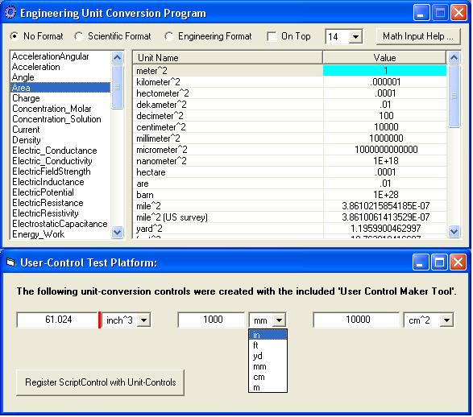



## Unit Conversion Tools

### Description

This distribution features two unit conversion programs, a Unit Conversion Class / User-Control Maker Tool, and class/control example programs.
 
### More Info
 

             |
---                |---
**Submitted On**   |2011-06-12 17:21:38
**By**             |[RandyT\_CS](https://github.com/Planet-Source-Code/PSCIndex/blob/master/ByAuthor/randyt-cs.md)
**Level**          |Advanced
**User Rating**    |5.0 (15 globes from 3 users)
**Compatibility**  |VB 6\.0
**Category**       |[Custom Controls/ Forms/  Menus](https://github.com/Planet-Source-Code/PSCIndex/blob/master/ByCategory/custom-controls-forms-menus__1-4.md)
**World**          |[Visual Basic](https://github.com/Planet-Source-Code/PSCIndex/blob/master/ByWorld/visual-basic.md)
**Archive File**   |[Unit\_Conve2206306142011\.zip](https://github.com/Planet-Source-Code/randyt-cs-unit-conversion-tools__1-73948/archive/master.zip)

